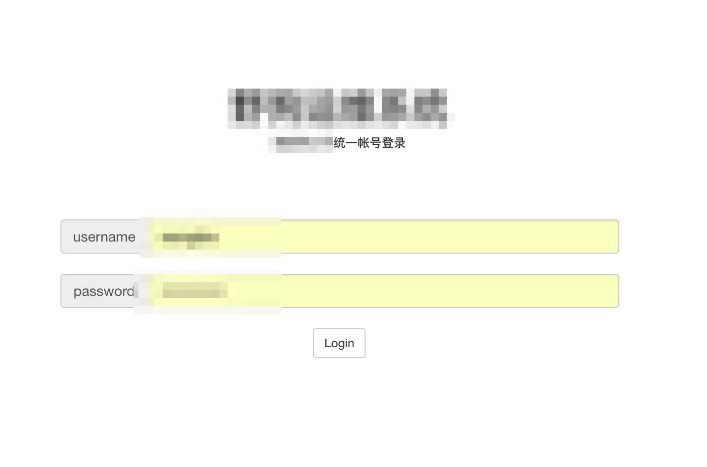
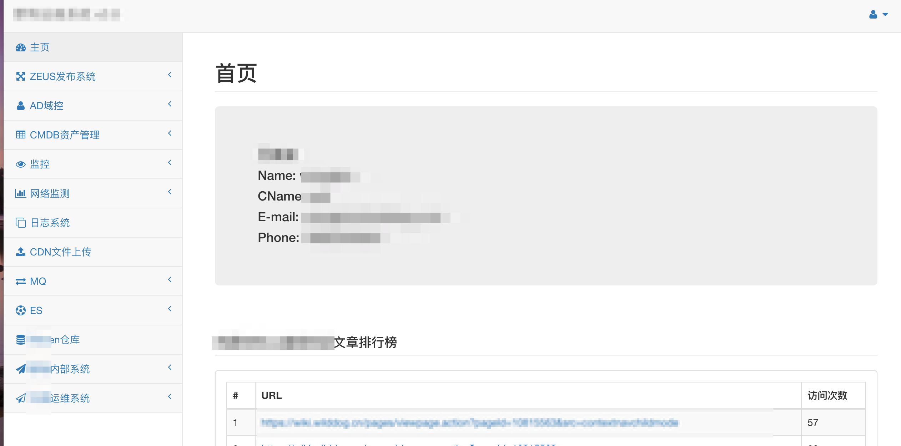
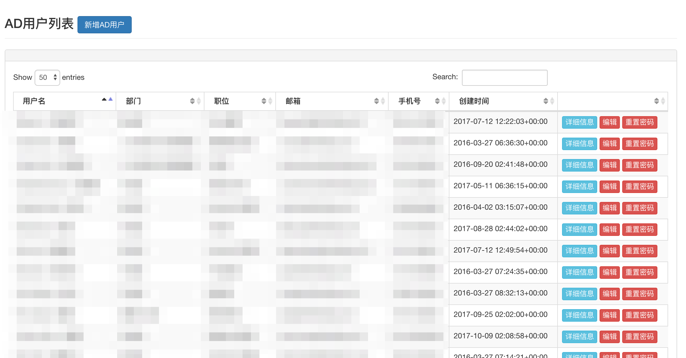
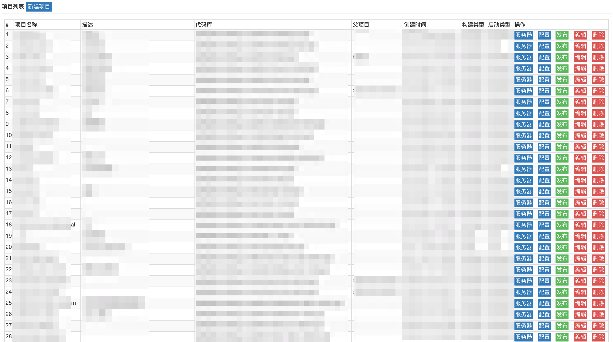
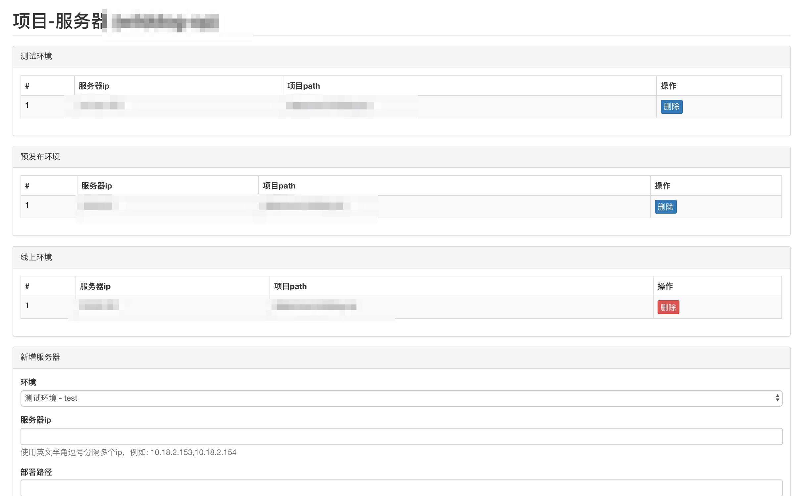
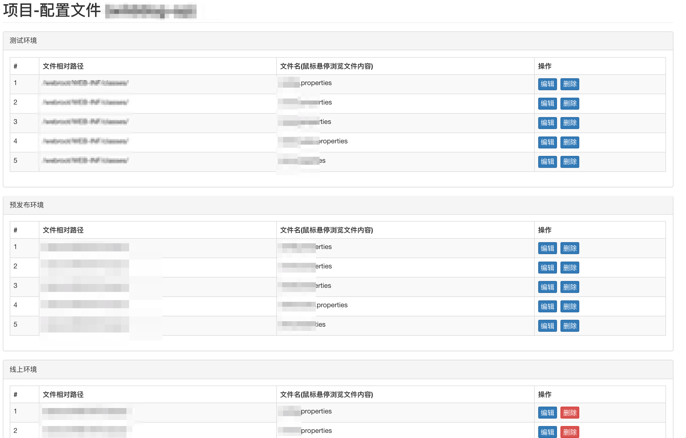
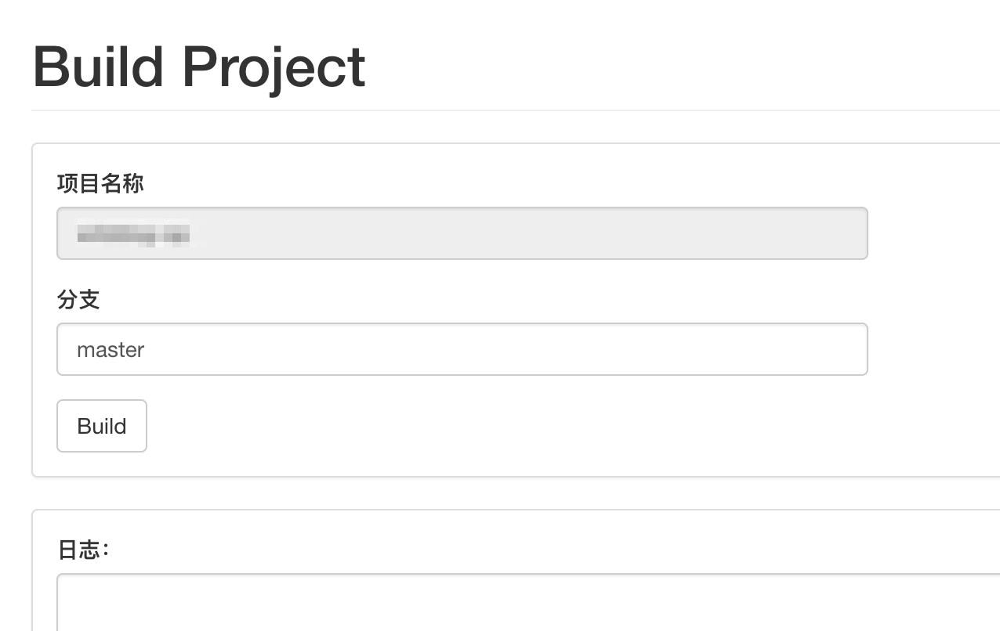
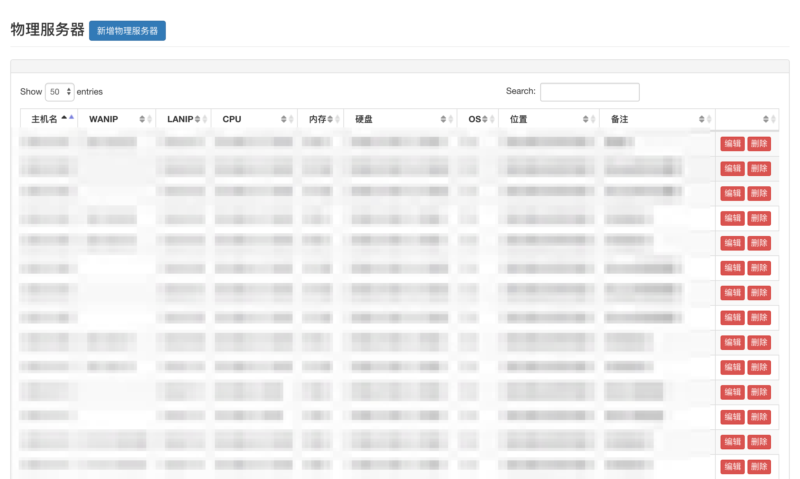
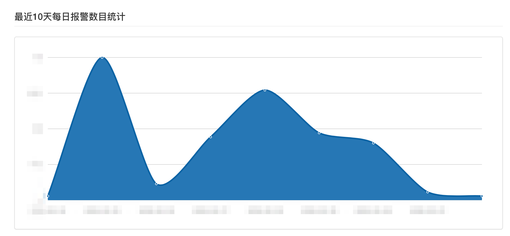

## OPS-WEB
OPS-WEB项目是综合运维平台，目前集成有初版的CMDB、LDAP帐号管理，Beta版的发布系统。  
目前功能都是可用，但不完善，还在不断完善中。

## 功能 ##

- Beta版发布系统，项目的快速发布
- LDAP帐号管理，对公司基于Microsoft AD的SSO帐号进行统一管理
- 初版的CMDB，用于服务器、项目、人员管理
- 其他运维系统的快速入口
- 每天报警数统计、LDAP认证等

## 运行方法 ##

- 在目标主机上git clone下来项目；
- 根据dao，在MySQL中新建库和表；
- 根据实际环境替换配置文件中的配置项，配置文件在opsweb/conf.py；
- 安装Python3虚拟环境
- 安装依赖模块（查看`requirements.txt`文件）
- 运行manage.py，启动项目

## 部分功能页面展示 ##

###### 登录页面  

  
###### 首页  

###### AD域控用户列表  

###### 发布系统项目  

###### 发布系统服务器配置  

###### 发布系统配置管理  

###### 发布系统构建列表 

###### 发布系统构建  

###### CMDB服务器列表  

###### 报警统计

## 开发环境 ##
Python3.6.1 + Flask 0.12 + MySQL + sb-admin-2模板  
依赖模块可以看`requirements.txt`文件

## 配置文件 ##
所有的配置项都在config.py文件中。
Config是基类包含所有调用配置。
有3个环境对象:

- TestingConfig（测试环境）
- PreReleaseConfig（预发布环境）
- ProductionConfig（线上正式环境）

## 登录 ##
登录OPS-WEB需要通过连接到Crowd进行认证（认证部分代码在opsweb/auth/crowd，可根据实际需求进行更改认证方式）。

## 发布系统说明 ##
发布系统可以在WEB-UI上对项目进行发布，依赖于gitlab系统（也可以是github）。  
发布系统的工作流程如下：

- git clone指定代码仓库和分支的代码
- 选择构建类型和启动方式（这些需要提前预定义好）
- 对代码进行编译
- 选择要发布的环境和主机（分为测试环境、预发布、线上环境）
- 进行配置文件的更改
- 打包
- 发布

这部分代码都在package zeus中，可根据实际需求进行调整

## CMDB系统说明 ##
CMDB系统目前涵盖的信息有物理服务器信息、KVM虚拟机信息、云主机信息、项目信息、服务器和项目所有者信息。

目前的作用有两个:
1. 存储CMDB信息；
2. 当主机和项目发生报警时，会根据CMDB中的信息，将报警增加指定负责人。

## AD系统说明 ##
AD系统通过WEB-UI方式实现对Microsoft AD进行管理，包括用户管理和组管理。  
目前已经实现所有增删改查功能。

